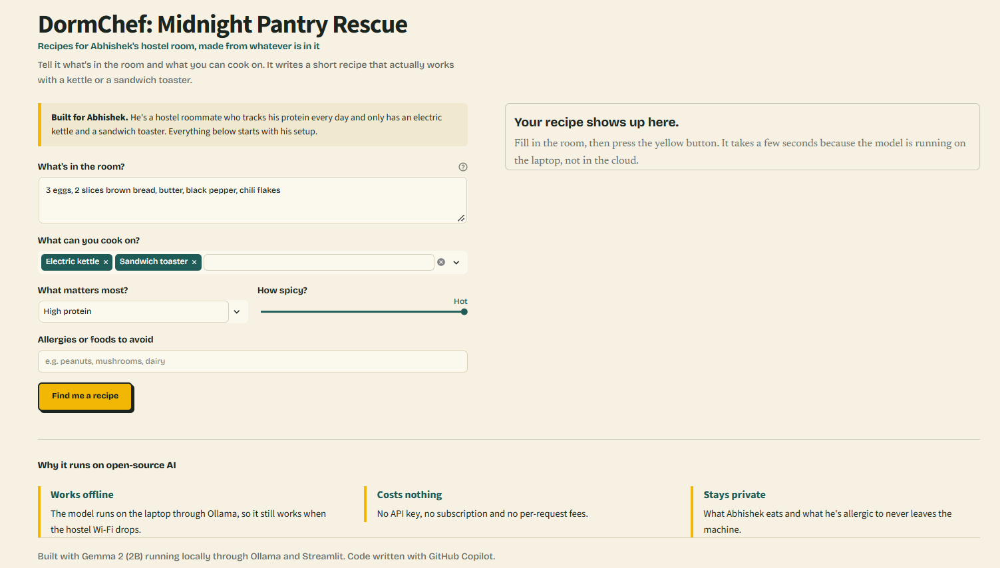
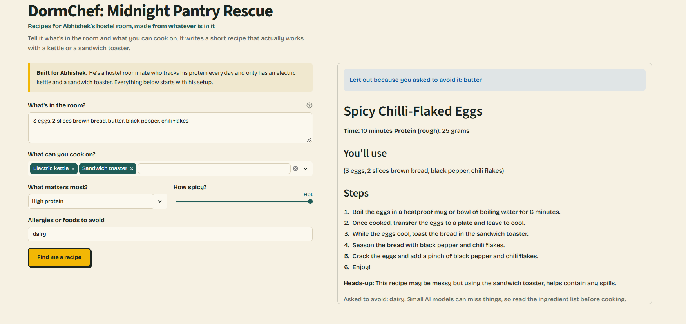

# 🍳 DormChef: Midnight Pantry Rescue

A local, offline-first culinary assistant designed for college dorm and hostel living. It solves a real late-night problem for my friend and roommate, **Abhishek**: turning random room snacks and pantry items into realistic meals without destroying dorm gear.

Built for the **[Hacktoberfest Weekend Challenge: Build for a Friend](https://dev.to/challenges/hacktoberfest-weekend-2026-10-01)**.

---

## 📸 Interface & Live Generation

| What's in the room | Generated Recipe (with appliance safety) |
| :---: | :---: |
|  |  |

---

## 🎯 Why I Built It for Abhishek

My friend Abhishek is an engineering student who hits the gym regularly and tracks his daily protein intake. In our hostel, dining mess food gets repetitive, dinner closes early, and after late-night study sessions, options are bleak. Food delivery is too expensive for a student budget, leaving him staring at whatever scraps are in our room cupboard: eggs, brown bread, butter, chili flakes, and black pepper.

His cooking options are strictly limited to what's allowed in our room:
- **Electric kettle** (Default)
- **Sandwich toaster / press** (Default)
- *Optional toggle for induction plate or no-cook assembly*

Standard online recipe apps assume an oven, a 4-burner stovetop, and full grocery access. Worse, generic cloud AI chatbots regularly suggest dangerous shortcuts—like telling someone to crack raw eggs or fry butter directly onto bare electric kettle heating coils, which burns out the element, sparks a short circuit, and incurs hostel inspection fines.

DormChef starts from Abhishek's actual setup. It knows what tools exist, prioritizes protein macros, and enforces strict appliance safety rules.

---

## 💡 Why Open-Source AI Matters

1. **It works offline:** Hostel and dorm Wi-Fi frequently cuts out or throttles past midnight. Because DormChef runs locally on the laptop via Ollama, the model generates recipes even with airplane mode on.
2. **Zero subscription cost:** College students cannot afford $20/month proprietary AI paywalls or per-token API charges just to figure out what to cook with leftover eggs and bread.
3. **Data stays private:** What Abhishek eats, his dietary habits, and his food allergies never leave the local laptop.
4. **Custom prompt steering:** Open weights allow us to tune the kitchen safety rules (no eggs directly on coils, sandwich toaster lining) in plain code without paying cloud platform fees.

---

## 🛡️ The Two-Stage Allergen & Safety Filter

Small language models (like 2B parameter weights) often struggle to strictly follow negative constraints—asking the model "don't use dairy" will often still result in a recipe with butter.

To prevent this, DormChef uses a two-stage filter built into the Python application layer:
1. **Pre-filter (Input sanitization):** Before the prompt reaches the model, Python scans the pantry items against common allergen groups (dairy, eggs, peanuts, tree nuts, gluten, soy, fish, shellfish). Any matching ingredient is stripped out automatically, and the UI notifies the user.
2. **Post-filter (Verification):** When Gemma 2 streams the finished recipe, the text is re-scanned. If a blocked word somehow slipped through, a prominent red warning is displayed.

*Note: This is a keyword filter for cooking safety, not a clinical tool. Always double-check ingredients manually if you have severe allergies.*

---

## 🛠️ Tech Stack & Prize Categories

- **Core Model:** [Google Gemma 2 (2B)](https://ai.google.dev/gemma) running locally — *Entering Best Use of Gemma*
- **Local Inference:** [Ollama](https://ollama.com)
- **Frontend:** [Streamlit](https://streamlit.io)

---

## 🚀 Run It Yourself

### Prerequisites
- Python 3.10 or newer
- [Ollama installed](https://ollama.com)

### Quickstart
1. **Clone the repository:**
 ```bash
git clone https://github.com/Razorbillworks/dormchef.git
cd dormchef
